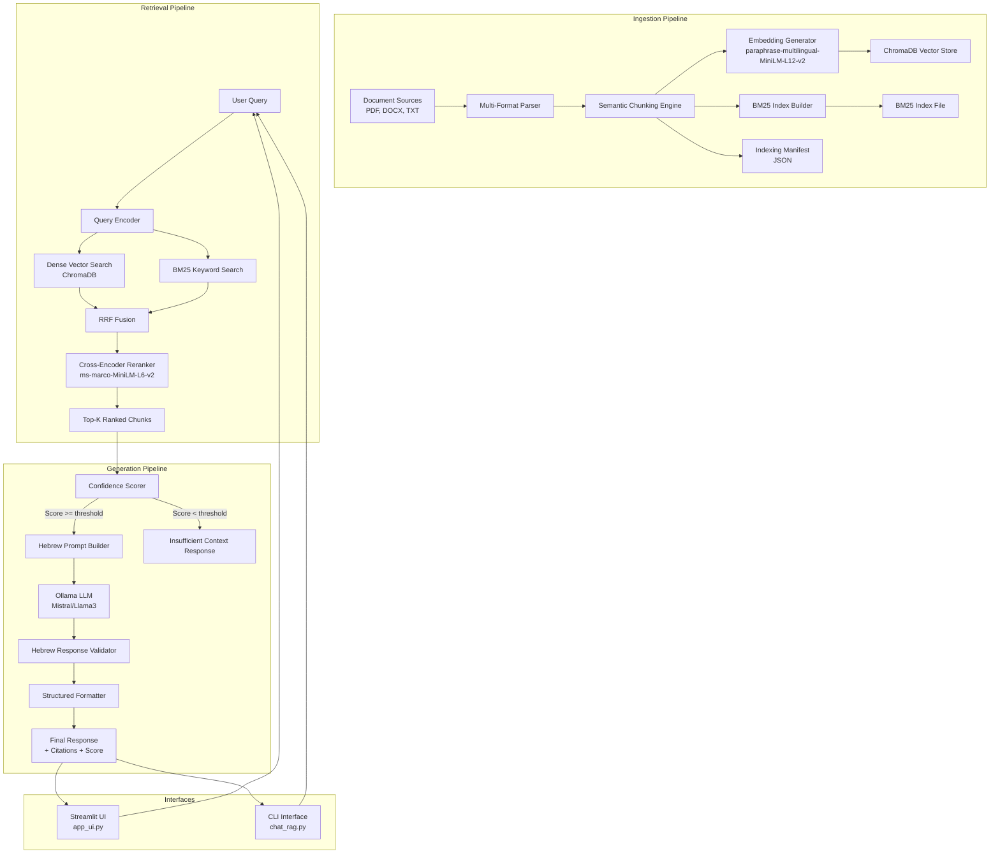
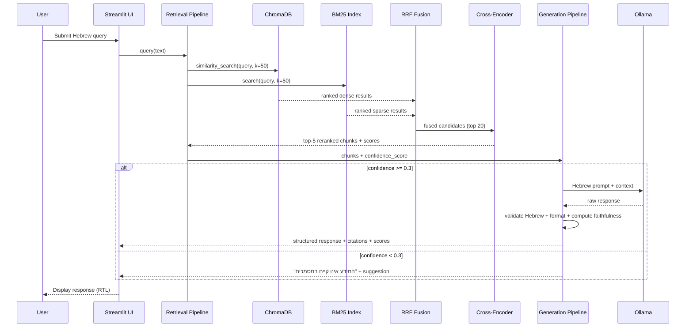

# Design Document: RAG Professional Upgrade

## Overview

This design document describes the architectural upgrade of the existing RAG (Retrieval-Augmented Generation) system from a basic prototype to a professional-grade Hebrew document querying platform. The upgrade refactors the current codebase (`rag_script.py`, `app_ui.py`, `chat_rag.py`, `query_rag.py`, `check_db.py`) into a modular, well-structured system with four core improvements:

1. **Multi-format document parsing** — replacing the DOCX-only loader with a unified parser supporting PDF, TXT, and DOCX
2. **Semantic chunking** — replacing naive `RecursiveCharacterTextSplitter` with section-aware, semantically coherent chunking
3. **Hybrid search with RRF fusion** — combining dense vector search (ChromaDB) with sparse BM25 keyword search
4. **Cross-encoder reranking** — adding a reranker stage to improve precision before LLM generation

The system continues to use **Ollama** for local LLM inference, **ChromaDB** as the vector store, and **HuggingFace** embeddings (`paraphrase-multilingual-MiniLM-L12-v2`). Hebrew remains the primary user language.

### Design Rationale

The existing code has several issues that this design addresses:
- **Inconsistent embedding models** — `chat_rag.py` and `check_db.py` use `all-MiniLM-L6-v2` while `rag_script.py` and `app_ui.py` use `paraphrase-multilingual-MiniLM-L12-v2`
- **DOCX-only parsing** — limits the knowledge base to a single format
- **No keyword search** — pure vector search misses exact Hebrew term matches
- **No reranking** — retrieval quality depends solely on embedding similarity
- **Monolithic scripts** — each file duplicates configuration and has no shared abstractions


## Architecture

### High-Level System Diagram



### Data Flow

1. **Ingestion**: Documents are loaded by the parser, split by the chunking engine, embedded, and stored in ChromaDB. Simultaneously, a BM25 index is built from the same chunks.
2. **Retrieval**: A user query triggers both dense and sparse searches. Results are fused via RRF and reranked by a cross-encoder.
3. **Generation**: The top-k chunks are evaluated for confidence. If above threshold, the LLM generates a Hebrew response with citations. If below, a predefined insufficient-information message is returned.


## Components and Interfaces

### Module Structure (Refactored)

The monolithic scripts are refactored into a package structure:

```
RAG/
├── config.py                  # Shared configuration (model names, paths, thresholds)
├── parsers/
│   ├── __init__.py
│   ├── base.py               # BaseParser abstract class
│   ├── docx_parser.py        # DOCX format parser
│   ├── pdf_parser.py         # PDF format parser (using pypdf)
│   └── txt_parser.py         # TXT format parser
├── chunking/
│   ├── __init__.py
│   └── semantic_chunker.py   # Section-aware semantic chunking engine
├── indexing/
│   ├── __init__.py
│   ├── embedder.py           # Unified embedding generator
│   ├── bm25_index.py         # BM25 index builder and searcher
│   └── pipeline.py           # Orchestrates full indexing flow (replaces rag_script.py)
├── retrieval/
│   ├── __init__.py
│   ├── dense_search.py       # ChromaDB vector search
│   ├── sparse_search.py      # BM25 keyword search
│   ├── rrf_fusion.py         # Reciprocal Rank Fusion
│   └── reranker.py           # Cross-encoder reranking
├── generation/
│   ├── __init__.py
│   ├── prompt_builder.py     # Hebrew prompt construction
│   ├── response_validator.py # Hebrew language enforcement
│   ├── formatter.py          # Structured response formatting
│   └── faithfulness.py       # Faithfulness scoring
├── app_ui.py                 # Streamlit UI (refactored to use modules)
├── chat_rag.py               # CLI interface (refactored to use modules)
└── check_db.py               # DB inspection utility (refactored)
```


### Component Interfaces

#### 1. Configuration (`config.py`)

```python
@dataclass
class RAGConfig:
    # Embedding
    embedding_model: str = "sentence-transformers/paraphrase-multilingual-MiniLM-L12-v2"
    
    # Chunking
    max_chunk_size: int = 1500       # characters (200-10000)
    chunk_overlap: int = 200         # characters (< 50% of max_chunk_size)
    min_chunk_size: int = 100        # minimum content characters
    
    # Retrieval
    dense_search_k: int = 50         # candidates from vector search
    bm25_search_k: int = 50          # candidates from BM25
    rrf_k: int = 60                  # RRF smoothing parameter (1-1000)
    fusion_candidates: int = 20      # chunks passed to reranker (1-100)
    
    # Reranking
    reranker_model: str = "cross-encoder/ms-marco-MiniLM-L6-v2"
    reranker_top_k: int = 5          # final chunks to LLM (1-20)
    reranker_timeout: float = 10.0   # seconds
    
    # Confidence
    confidence_threshold: float = 0.3  # minimum relevance score
    faithfulness_threshold: float = 0.7
    
    # Paths
    db_directory: str = "./db"
    bm25_index_path: str = "./db/bm25_index.pkl"
    manifest_path: str = "./db/indexing_manifest.json"
    
    # LLM
    llm_model: str = "mistral"
    llm_temperature: float = 0.0
    llm_timeout: int = 60
```

#### 2. Parser Interface (`parsers/base.py`)

```python
from abc import ABC, abstractmethod
from dataclasses import dataclass

@dataclass
class TextSegment:
    content: str
    metadata: dict  # Must include "source" key with file path

class BaseParser(ABC):
    @abstractmethod
    def parse(self, file_path: str) -> list[TextSegment]:
        """Extract text segments from a document file."""
        ...
    
    @abstractmethod
    def supports(self, file_path: str) -> bool:
        """Check if this parser can handle the given file extension."""
        ...
```


#### 3. Chunking Engine Interface (`chunking/semantic_chunker.py`)

```python
@dataclass
class Chunk:
    content: str
    metadata: dict  # source, chunk_index, section_title

class SemanticChunker:
    def __init__(self, config: RAGConfig):
        self.max_size = config.max_chunk_size
        self.overlap = config.chunk_overlap
        self.min_size = config.min_chunk_size
    
    def chunk_document(self, text: str, source: str) -> list[Chunk]:
        """Split document text into semantically coherent chunks.
        
        Strategy (in priority order):
        1. Split at section boundaries (headings)
        2. Split at paragraph boundaries (double newlines)
        3. Split at character-length limits within paragraphs
        """
        ...
    
    def _detect_sections(self, text: str) -> list[tuple[int, str]]:
        """Identify section boundaries and their titles."""
        ...
    
    def _merge_trailing_fragment(self, chunks: list[Chunk]) -> list[Chunk]:
        """Merge final chunk into preceding if < min_size chars."""
        ...
```

#### 4. BM25 Index Interface (`indexing/bm25_index.py`)

```python
class BM25Index:
    def __init__(self, config: RAGConfig):
        self.index_path = config.bm25_index_path
        self._index: BM25Okapi | None = None
        self._documents: list[Chunk] = []
    
    def build(self, chunks: list[Chunk]) -> None:
        """Build BM25 index from chunks and persist to disk."""
        ...
    
    def search(self, query: str, k: int = 50) -> list[tuple[Chunk, float]]:
        """Search BM25 index, returning chunks with BM25 scores."""
        ...
    
    def _tokenize_hebrew(self, text: str) -> list[str]:
        """Tokenize Hebrew text: split on whitespace and Unicode punctuation
        (including maqaf, geresh, gershayim) while preserving niqqud."""
        ...
    
    def load(self) -> None:
        """Load persisted BM25 index from disk."""
        ...
```


#### 5. RRF Fusion Interface (`retrieval/rrf_fusion.py`)

```python
class RRFFusion:
    def __init__(self, k: int = 60):
        """Initialize RRF with smoothing parameter k.
        
        RRF formula: score(d) = sum(1 / (k + rank_i(d))) for each system i
        """
        self.k = k
    
    def fuse(
        self, 
        dense_results: list[tuple[Chunk, float]], 
        sparse_results: list[tuple[Chunk, float]],
        top_n: int = 20
    ) -> list[tuple[Chunk, float]]:
        """Merge ranked lists using Reciprocal Rank Fusion.
        Returns top_n chunks ordered by fused score."""
        ...
```

#### 6. Reranker Interface (`retrieval/reranker.py`)

```python
class CrossEncoderReranker:
    def __init__(self, config: RAGConfig):
        self.model_name = config.reranker_model
        self.top_k = config.reranker_top_k
        self.timeout = config.reranker_timeout
        self._model: CrossEncoder | None = None
    
    def rerank(
        self, query: str, chunks: list[tuple[Chunk, float]]
    ) -> list[tuple[Chunk, float]]:
        """Score each chunk against query using cross-encoder.
        Returns top-k chunks sorted by relevance score (0.0-1.0).
        Falls back to original ranking on timeout/failure."""
        ...
```

#### 7. Generation Pipeline Interface (`generation/prompt_builder.py`)

```python
class HebrewPromptBuilder:
    def build_prompt(
        self, query: str, chunks: list[tuple[Chunk, float]]
    ) -> ChatPromptTemplate:
        """Construct Hebrew-enforced prompt with context and query.
        Includes system-level and user-level Hebrew directives."""
        ...

class ResponseValidator:
    def validate_hebrew(self, response: str) -> tuple[bool, str]:
        """Check response for Hebrew compliance.
        Returns (is_valid, cleaned_response).
        If >2 consecutive Latin words (not proper nouns), returns False."""
        ...

class ResponseFormatter:
    def format(self, response: str, sources: list[str], score: float) -> str:
        """Format response into structured output:
        Line 1: Hebrew title (≤10 words)
        Line 2+: Answer paragraph
        Final line: Source citations"""
        ...
```


#### 8. Faithfulness Scorer (`generation/faithfulness.py`)

```python
class FaithfulnessScorer:
    def score(self, response: str, context_chunks: list[Chunk]) -> float:
        """Compute faithfulness score (0.0-1.0).
        Decomposes response into claims and verifies each against context.
        Returns proportion of supported claims."""
        ...
    
    def _extract_claims(self, response: str) -> list[str]:
        """Break response into individual factual claims."""
        ...
    
    def _verify_claim(self, claim: str, context: str) -> bool:
        """Check if a claim is supported by the context."""
        ...
```

### Component Interaction Sequence




## Data Models

### Core Data Types

```python
from dataclasses import dataclass, field
from typing import Optional
from datetime import datetime

@dataclass
class TextSegment:
    """Raw text extracted from a document by the parser."""
    content: str
    metadata: dict = field(default_factory=dict)
    # metadata always contains: {"source": "/path/to/file.ext"}

@dataclass
class Chunk:
    """A semantically coherent text segment ready for indexing."""
    content: str
    metadata: dict = field(default_factory=dict)
    # metadata contains:
    #   "source": str - file path
    #   "chunk_index": int - zero-based index within document
    #   "section_title": str - nearest preceding section header or ""

@dataclass
class ScoredChunk:
    """A chunk with a retrieval/reranking relevance score."""
    chunk: Chunk
    score: float  # 0.0 to 1.0
    source_method: str = ""  # "dense", "bm25", "rrf", "reranker"

@dataclass
class GenerationResult:
    """Complete result of the generation pipeline."""
    title: str                    # Hebrew title (≤10 words)
    answer: str                   # Answer paragraph
    sources: list[str]            # Source document file names
    confidence_score: float       # Average reranker score (0.0-1.0)
    faithfulness_score: float     # Faithfulness metric (0.0-1.0)
    is_insufficient: bool = False # True if no relevant context found
    low_confidence_warning: bool = False  # True if faithfulness < 0.7

@dataclass
class IndexingManifest:
    """Record of an indexing batch run."""
    successful_files: list[dict]  # [{"name": str, "chunk_count": int}]
    failed_files: list[dict]      # [{"name": str, "error": str}]
    total_chunks: int
    timestamp: str                # ISO 8601 UTC
```

### Persisted Data

| Store | Format | Location | Description |
|-------|--------|----------|-------------|
| Vector embeddings | ChromaDB | `./db/` | Dense vector store for similarity search |
| BM25 index | Pickle | `./db/bm25_index.pkl` | Serialized BM25Okapi index + document references |
| Indexing manifest | JSON | `./db/indexing_manifest.json` | Record of last indexing run |
| Sync marker | Text | `./db/last_updated.txt` | Timestamp for UI sync check |

### Configuration Validation Rules

| Parameter | Range | Default | Constraint |
|-----------|-------|---------|------------|
| `max_chunk_size` | 200–10000 | 1500 | Must be integer |
| `chunk_overlap` | 0–(max/2) | 200 | Must be < 50% of max_chunk_size |
| `min_chunk_size` | 1–max | 100 | Must be < max_chunk_size |
| `rrf_k` | 1–1000 | 60 | Smoothing parameter |
| `fusion_candidates` | 1–100 | 20 | Chunks to pass to reranker |
| `reranker_top_k` | 1–20 | 5 | Final chunks to LLM |
| `confidence_threshold` | 0.0–1.0 | 0.3 | Insufficient context boundary |
| `faithfulness_threshold` | 0.0–1.0 | 0.7 | Low-confidence warning trigger |


## Correctness Properties

*A property is a characteristic or behavior that should hold true across all valid executions of a system — essentially, a formal statement about what the system should do. Properties serve as the bridge between human-readable specifications and machine-verifiable correctness guarantees.*

### Property 1: TXT Parser Round-Trip

*For any* valid UTF-8 string content, writing it to a `.txt` file and then parsing that file with the TXT parser SHALL produce exactly one `TextSegment` whose `content` field is identical to the original string.

**Validates: Requirements 1.3**

### Property 2: Batch Processing Resilience

*For any* batch of documents containing a mix of valid and invalid (corrupt/unsupported) files, the parser SHALL successfully produce segments for all valid files in the batch, and the count of successfully parsed documents SHALL equal the count of valid files regardless of the number or position of invalid files.

**Validates: Requirements 1.4, 10.2**

### Property 3: Metadata Completeness Invariant

*For any* document processed by the parsing and chunking pipeline, every resulting chunk SHALL have metadata containing: (a) a `source` field matching the original file path, (b) a `chunk_index` field that is a non-negative integer, and (c) a `section_title` field that is a string (possibly empty).

**Validates: Requirements 1.5, 2.4**

### Property 4: Unsupported Extension Filtering

*For any* file path with an extension not in the set {`.docx`, `.pdf`, `.txt`}, the parser SHALL produce zero text segments for that file and SHALL not raise an exception or halt the batch.

**Validates: Requirements 1.6**


### Property 5: Non-Empty Extraction Guarantee

*For any* document that is successfully loaded without error, the parser SHALL produce at least one `TextSegment` whose `content` contains at least one visible (non-whitespace) character.

**Validates: Requirements 1.7**

### Property 6: Maximum Chunk Size Invariant

*For any* document text and any valid chunking configuration (max_chunk_size in [200, 10000], overlap < 50% of max_chunk_size), every chunk produced by the Chunking Engine SHALL have a `content` field with length less than or equal to `max_chunk_size`.

**Validates: Requirements 2.2**

### Property 7: Chunking Structural Boundary Priority

*For any* document containing explicit section headers (lines matching heading patterns), the Chunking Engine SHALL prefer to split at section boundaries over paragraph boundaries, and at paragraph boundaries over arbitrary character positions, unless a section or paragraph exceeds `max_chunk_size`.

**Validates: Requirements 2.1, 2.3**

### Property 8: Minimum Chunk Content Size

*For any* chunking output of a document, every chunk (including the final chunk after merge) SHALL contain at least `min_chunk_size` (100) characters of content excluding overlap, unless the entire document is shorter than `min_chunk_size`.

**Validates: Requirements 2.5, 2.6**

### Property 9: RRF Fusion Score Correctness

*For any* two ranked lists of chunks (from dense and sparse search) and any valid RRF k parameter (1-1000), the fused output score for each chunk SHALL equal the sum of `1/(k + rank_i)` across all lists where that chunk appears, and the output SHALL be sorted in descending order by fused score.

**Validates: Requirements 4.2**


### Property 10: Hebrew Tokenization Preserves Niqqud

*For any* Hebrew string containing niqqud (diacritics), the tokenizer SHALL split on whitespace and Unicode punctuation characters (including maqaf ־, geresh ׳, gershayim ״) while keeping niqqud characters as part of the token they are attached to, so that tokens are never split within a base-character + niqqud sequence.

**Validates: Requirements 4.4**

### Property 11: Single-Method Fallback on Empty Results

*For any* query where exactly one of the two search methods (dense or BM25) returns zero results, the RRF fusion SHALL return exactly the results from the non-empty method, ranked by that method's original score, without raising an error.

**Validates: Requirements 4.6**

### Property 12: Reranker Output Ordering and Score Attachment

*For any* set of candidate chunks scored by the reranker, the output SHALL be sorted in descending order by relevance score, limited to at most `top_k` chunks, and each chunk SHALL have a numeric `relevance_score` in [0.0, 1.0] attached to its metadata.

**Validates: Requirements 5.1, 5.2, 5.4**

### Property 13: Confidence Score Computation

*For any* non-empty list of reranker relevance scores, the Confidence Score SHALL equal the arithmetic mean of those scores, rounded to two decimal places.

**Validates: Requirements 8.5, 8.6**

### Property 14: Insufficient Context Classification

*For any* set of retrieved chunks where the maximum relevance score is below the configured `confidence_threshold` (default 0.3), OR where zero chunks are returned, the system SHALL classify the query as having insufficient context and return the predefined Hebrew message "המידע אינו קיים במסמכים" with an appended suggestion to rephrase the query.

**Validates: Requirements 7.3, 8.1, 8.2, 8.3, 8.4**


### Property 15: Faithfulness Score Range and Proportionality

*For any* generated response decomposed into N claims where M claims are supported by the context, the Faithfulness Score SHALL equal M/N (or 1.0 when N=0), and SHALL always be in the range [0.0, 1.0].

**Validates: Requirements 7.4**

### Property 16: Low-Confidence Warning Threshold

*For any* generated response with a computed Faithfulness Score, the `low_confidence_warning` flag SHALL be `True` if and only if the Faithfulness Score is below 0.7.

**Validates: Requirements 7.5**

### Property 17: Response Structure Format

*For any* generated response after formatting, the output SHALL consist of exactly three parts: (1) a first line containing a Hebrew title of at most 10 words, (2) a subsequent paragraph containing the answer, and (3) a final line listing all contributing source document file names separated by commas.

**Validates: Requirements 9.1, 9.2, 9.3**

### Property 18: No Introductory Preambles

*For any* formatted response, the answer paragraph SHALL NOT begin with phrases referencing the retrieval process (such as "based on the documents", "according to the sources", "from the retrieved information", or their Hebrew equivalents).

**Validates: Requirements 9.4**

### Property 19: Latin Word Sequence Detection

*For any* text string, the Hebrew validator SHALL correctly identify sequences of more than 2 consecutive Latin-alphabet words that are not proper nouns, returning `False` (invalid) when such sequences exist and `True` (valid) when they do not.

**Validates: Requirements 6.6**

### Property 20: Indexing Manifest Accuracy

*For any* completed indexing run with known input files, the JSON manifest SHALL contain: (a) all successfully indexed file names with correct chunk counts, (b) all failed file names with non-empty error descriptions, (c) a `total_chunks` field equal to the sum of individual chunk counts, and (d) a valid ISO 8601 UTC timestamp.

**Validates: Requirements 10.4**

### Property 21: Embedding Model Mismatch Detection

*For any* retrieval query where the query embedding model name differs from the model name stored in the index metadata, the system SHALL refuse to return results and report an error containing both the expected and actual model names.

**Validates: Requirements 3.4**


## Error Handling

### Error Categories and Strategies

| Category | Source | Strategy | User-Facing Behavior |
|----------|--------|----------|---------------------|
| Document load failure | Corrupt/unreadable file | Skip + log to stdout | Batch continues; manifest records failure |
| Unsupported file type | Non-DOCX/PDF/TXT file | Silent skip | No output; batch continues |
| Embedding model failure | Model download/load error | Halt with message | Execution stops; error names the model |
| Embedding mismatch | Query model ≠ index model | Refuse results + error | Error message with expected vs actual model |
| Reranker timeout | Cross-encoder > 10s | Fallback to original ranking | User gets results without reranking |
| Reranker initialization failure | Model load error | Fallback to original ranking | User gets results without reranking |
| LLM connection failure | Ollama not running | Display error | UI shows "Ollama not running" message |
| LLM timeout | Generation exceeds timeout | Display timeout error | UI shows timeout message with retry suggestion |
| Insufficient context | Max score < 0.3 or zero chunks | Return predefined message | "המידע אינו קיים במסמכים" + rephrase suggestion |
| Low faithfulness | Faithfulness score < 0.7 | Show warning alongside answer | Answer displayed with visible warning indicator |
| Hebrew enforcement failure | >2 Latin words in response | Re-prompt LLM | User never sees non-Hebrew response |
| Response format violation | Malformed LLM output | Reformat automatically | User always sees structured response |
| BM25 index missing | Index not built yet | Dense-only search fallback | Results still returned from vector search |
| All documents fail indexing | Entire batch corrupt | Complete gracefully | Manifest written with zero successes |

### Error Propagation Rules

1. **Parser errors** are contained per-file — never propagate to halt the batch
2. **Retrieval errors** in one method (dense or BM25) fall back to the other method
3. **Reranker errors** fall back to the original retrieval ranking
4. **Generation errors** (Hebrew violation, format issues) are self-healing via re-prompting or reformatting
5. **Infrastructure errors** (Ollama, ChromaDB) halt with clear diagnostic messages
6. **Configuration errors** (invalid ranges) are caught at startup with descriptive validation messages


## Testing Strategy

### Testing Framework

- **Unit tests and property tests**: `pytest` with `hypothesis` (Python property-based testing library)
- **Integration tests**: `pytest` with mocked Ollama/ChromaDB where needed
- **Minimum iterations**: 100 per property test (as configured in Hypothesis settings)

### Property-Based Tests

Each correctness property from the design document is implemented as a single Hypothesis property test with the following tagging format:

```python
# Feature: rag-professional-upgrade, Property {N}: {property_text}
```

Property tests target pure functions and deterministic logic:
- **Chunking logic**: Properties 6, 7, 8 — generate random texts + configs, verify size/boundary/min invariants
- **RRF fusion**: Property 9 — generate random ranked lists, verify score formula and ordering
- **Hebrew tokenizer**: Property 10 — generate Hebrew strings with niqqud/punctuation, verify split rules
- **Confidence scoring**: Property 13 — generate random score lists, verify arithmetic mean
- **Threshold classification**: Property 14 — generate random score sets, verify threshold logic
- **Faithfulness scoring**: Property 15, 16 — generate claim/support pairs, verify proportion
- **Response formatting**: Properties 17, 18 — generate random text, verify structure rules
- **Latin sequence detection**: Property 19 — generate mixed strings, verify detection accuracy
- **Metadata invariants**: Properties 3, 4, 5 — generate documents, verify metadata fields
- **Parser round-trip**: Property 1 — generate UTF-8 strings, verify TXT round-trip
- **Batch resilience**: Property 2 — generate mixed valid/invalid batches, verify processing
- **Manifest accuracy**: Property 20 — generate indexing runs, verify manifest structure
- **Model mismatch**: Property 21 — generate model name pairs, verify detection

### Unit Tests (Example-Based)

Unit tests complement property tests for specific scenarios:
- DOCX parsing with tables, headings, nested structures
- PDF parsing with multi-page documents and paragraph separation
- Reranker fallback behavior on timeout (mocked)
- Hebrew enforcement re-prompting on violation (mocked LLM)
- Response reformatting for malformed LLM outputs
- Embedding model initialization failure handling
- Empty document edge cases

### Integration Tests

Integration tests verify component wiring:
- Full ingestion pipeline: parse → chunk → embed → store (with test documents)
- Full retrieval pipeline: query → dual search → fuse → rerank
- End-to-end query: user question → structured Hebrew response
- BM25 index rebuild after document ingestion
- Progress output during batch indexing
- Sync marker file creation

### Test Organization

```
tests/
├── properties/
│   ├── test_chunking_props.py      # Properties 6, 7, 8
│   ├── test_rrf_props.py           # Property 9
│   ├── test_tokenizer_props.py     # Property 10, 11
│   ├── test_reranker_props.py      # Property 12
│   ├── test_scoring_props.py       # Properties 13, 14, 15, 16
│   ├── test_formatter_props.py     # Properties 17, 18, 19
│   ├── test_parser_props.py        # Properties 1, 2, 3, 4, 5
│   └── test_manifest_props.py      # Properties 20, 21
├── unit/
│   ├── test_docx_parser.py
│   ├── test_pdf_parser.py
│   ├── test_reranker_fallback.py
│   ├── test_hebrew_validator.py
│   └── test_response_formatter.py
└── integration/
    ├── test_ingestion_pipeline.py
    ├── test_retrieval_pipeline.py
    └── test_end_to_end.py
```

### Key Library Dependencies

| Library | Purpose | Version |
|---------|---------|---------|
| `hypothesis` | Property-based testing | ≥6.0 |
| `pytest` | Test runner | ≥7.0 |
| `rank-bm25` | BM25Okapi implementation | ≥0.2 |
| `sentence-transformers` | Cross-encoder reranker | ≥2.0 |
| `pypdf` | PDF text extraction | ≥4.0 |
| `python-docx` | DOCX text extraction (replaces docx2txt) | ≥1.0 |
| `langchain-chroma` | ChromaDB vector store integration | existing |
| `langchain-huggingface` | HuggingFace embeddings | existing |
| `langchain-ollama` | Ollama LLM integration | existing |
| `streamlit` | Web UI framework | existing |
